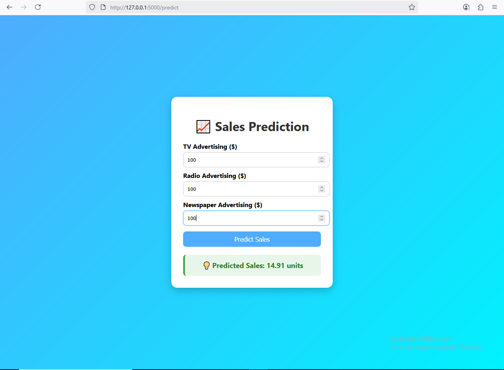

# Sales Prediction Web App

A machine learning-powered web application that predicts sales based on advertising budgets for TV, Radio, and Newspaper.  
Built with **Flask**, **Scikit-learn**, and an interactive UI.

---

## 📌 Features
- Predicts sales from given marketing spends.
- Multiple machine learning models trained and compared.
- Easy-to-use and responsive web interface.
- Visual model comparison chart.
- Ready to deploy.

---

## 📂 Project Structure

├── app.py # Flask backend
├── best_sales_model.pkl # Trained ML model
├── data/ # Dataset folder
├── static/ # Static files (CSS, images, JS)
│ └── demo.png # App demo screenshot
├── templates/ # HTML templates
├── requirements.txt # Dependencies
├── model_comparison.png # Model comparison chart
├── README.md # Project documentation
└── LICENSE

---

## 🚀 Demo

---

## ⚙️ Installation & Usage

### 1️⃣ Clone the repository

git clone https://github.com/YourUsername/YourRepoName.git
cd YourRepoName

### 2️⃣ Install dependencies

pip install -r requirements.txt

### 3️⃣ Run the Flask app

python app.py

### 4️⃣ Open in browser

http://127.0.0.1:5000/

---

## 🧠 Model Details

Dataset: Advertising budget vs. sales

Models used:

Linear Regression

Decision Tree Regressor

Random Forest Regressor

XGBoost Regressor

Selected best-performing model and saved as best_sales_model.pkl

---

## 📜 License

This project is licensed under the MIT License - see the LICENSE file for details.

---

## 🤝 Contributing

Pull requests are welcome!
For major changes, please open an issue first to discuss what you’d like to change.

---

👨‍💻 Author

Ankit Kumar
GitHub: https://github.com/AnkitKumarIISERB

---

